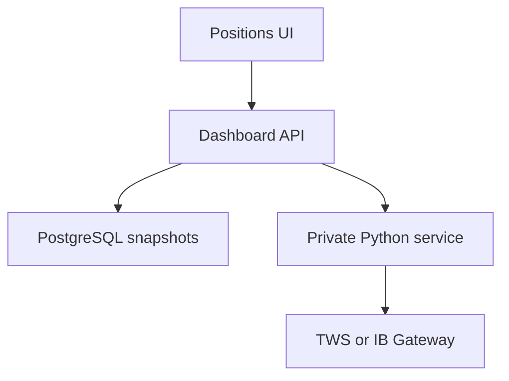

# Interactive Brokers portfolio analytics

## Scope

This integration turns the supplied IBKR portfolio script and analytics brief into a read-only workflow inside **Positions**:

1. the private Python service connects to TWS or IB Gateway;
2. the dashboard requests and stores an immutable account snapshot;
3. Positions shows balance, cash, allocation, cost basis, current value, P&L, return, first detected fill, holding days and available annualized return;
4. a compatible base-case DCF from the existing valuation workflow is compared with the broker price;
5. users can calculate and audit an order preview subject to configured caps.

No application code can submit, transmit or stage an IBKR order. Human trade execution remains outside Portfolio Intelligence.
Broker snapshots and previews are restricted to the platform administrator because the bridge is configured for one private broker session.

## Runtime topology

The gateway owns IBKR login and authentication. It must be running, API socket access must be enabled, and its configured socket port must be reachable from `filings-python`. The dashboard never receives the complete account identifier.

## Railway variables

Set on the **dashboard** service:

| Variable | Purpose |
| --- | --- |
| `FILINGS_API_URL` | Private Railway URL for `filings-python` |
| `FILINGS_INTERNAL_TOKEN` | Shared random secret of at least 32 characters |

Set on the **filings-python** service:

| Variable | Required | Purpose |
| --- | --- | --- |
| `FILINGS_INTERNAL_TOKEN` | Yes | Same secret as the dashboard |
| `IBKR_ENABLED` | Yes | Use `true` only after paper-account testing |
| `IBKR_HOST` | When enabled | Hostname reachable from the service |
| `IBKR_PORT` | Yes | Gateway or TWS socket port; defaults to `4002` |
| `IBKR_CLIENT_ID` | Yes | Dedicated API client id; defaults to `41` |
| `IBKR_ACCOUNT` | For multiple accounts | Account selected inside the private adapter |
| `IBKR_MAX_ORDER_AMOUNT` | Yes | Maximum requested value allowed by a preview |
| `IBKR_MAX_CASH_PORTION` | Yes | Maximum portion of available funds for a buy preview |
| `IBKR_ALLOWED_SYMBOLS` | No | Comma-separated symbol allowlist |

Apply dashboard migration `0017_ibkr_portfolio_analytics.sql` before using the screen.

## Data meaning and limits

- Allocation uses the absolute market value of supported long equities plus positive cash.
- Non-equity, zero and short positions are omitted and recorded as snapshot information gaps.
- `first detected fill` uses only executions returned by the connected TWS or Gateway session. It can be absent or later than the original purchase.
- Annualized return is shown only when a detected fill is at least 30 days old. It is based on current average cost and does not reconstruct cash flows.
- DCF upside appears only when the existing valuation result has the same ticker and currency. An exact exchange match is preferred; ticker-only matching is allowed only when unambiguous.
- Broker snapshots are retained per user with the latest 30 kept. Order previews remain as an audit record.
