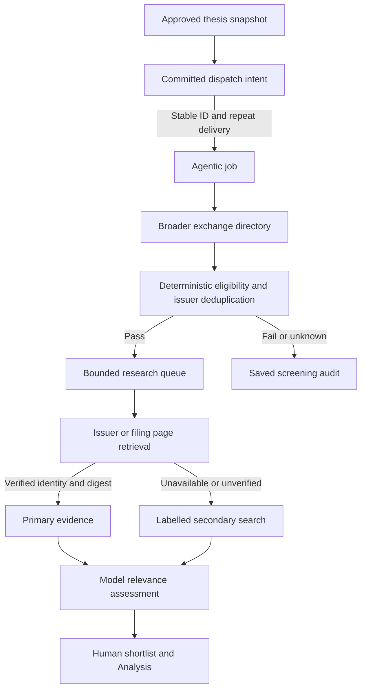

# Discovery follow-up: dispatch, coverage and primary evidence

Based on merged PR #92 (main commit `a7e6277608b730da80122aaaae99e7027ff9e69c`). The [cross-service contract proposal](discovery-completion-contract.md) preceded these changes. This report describes code and controlled tests, not production market results or a claim that every financial assertion is verified.

## Implemented flow

### Durable dispatch

Previously the dashboard called the service inside a transaction *before* it inserted its local run. A lost HTTP response or database rollback could leave a remote job with no local record. The dashboard now commits a `dispatching` run with an immutable UUID and full request first. The service maps that UUID to a stable external ID. Its database uses the existing unique `external_id` constraint to atomically return the original job on repeat POST only if the saved JSON payload and job kind match; a changed payload returns HTTP 409.

The dashboard reconciles `dispatching` intents on owner polling and in the authenticated refresh cron. A bounded ten-row daily window rotates through pending work so old unavailable intents do not always starve new ones. Repeat delivery always uses the saved payload. It keeps the intent pending until the status and result are imported together, so a crash after a remote completion does not turn into a completed local row with a missing result. Owner advisory locks coordinate this with thesis confirmation. Once the thesis changes, reconciliation checks whether the remote job exists; it does not create new research for an obsolete thesis. A confirmed client/contract rejection is marked failed with an actionable message. A timeout remains pending because acceptance is unknown.

The scheduled refresh currently runs daily; an owner reopening Discovery triggers polling every four seconds while an intent is pending. There is no guarantee of immediate autonomous recovery when the cron is disabled or provider is unavailable indefinitely. Existing rows and service jobs remain readable; no database migration is needed. The agentic service must be deployed before the dashboard starts issuing `dispatchId` requests. Drain older in-flight jobs during rollout.

### Wider market coverage with bounded research

The dashboard default is now up to **2,000 exchange listings per supported market** (`DISCOVERY_UNIVERSE_LIMIT`, configurable 100–4,000). The shared request accepts up to 10,000 records. Finnhub receives the entire supported exchange symbol list and caps it only after deduplication; it labels truncation and unranked input. EODHD broad requests use its exchange directory as the coverage layer. Optional financial enrichment pages through the screener in at most ten 100-row requests (offset 0–900); failure leaves listing identity and explicit unavailable enrichment, never invented metrics. The app retains its dated seed supplements and existing cache/fallback behavior.

The reason for the EODHD boundary is its [documented 500-row request and offset 999 ceiling](https://eodhd.com/financial-apis/stock-market-screener-api). Its [exchange symbol list](https://eodhd.com/financial-apis/exchanges-api-list-of-tickers-and-trading-hours) provides the directory. Actual endpoint entitlement depends on the account and was not queried in production.

Hard constraints and issuer/known-security checks run across the supplied records first. The **per-portfolio research budget defaults to 40** (`DISCOVERY_RESEARCH_BUDGET`, configurable 1–100), separate from the 1–20 candidate shortlist cap. Eligible listings beyond that budget have the explicit `budget_deferred` status and remain visible in the screening funnel. They did *not* fail the thesis. Primary listings then stable listing identifiers define processing order; that is not an investment ranking. Repeated runs may consider different issuers as previous names become known, but the system is still bounded and should not claim complete market recall if `universe_truncated` is true.

Financial metrics not supplied on a listing remain UNKNOWN, especially beyond optional screener coverage. Domicile, operations, revenue geography and trading/reporting currencies remain distinct. No implicit FX conversion or financial data fabrication was added.

### Primary-source verification

After eligibility, the dashboard makes bounded company-profile requests for the research queue only. EODHD `General.WebURL` or Finnhub `profile2.weburl` enters the saved request when the provider's company name or ISIN matches the listing. The profile lookup has an eight-second deadline per security; unavailable entitlements or mismatched identities leave the URL absent. For an eligible security with that provider-grounded issuer website or a supplied SEC filing/investor-relations URL, the service retrieves the source **before** general search. The fetch requires HTTPS, a public IPv4 DNS answer pinned to the TLS connection, same-host redirects, a 10-second response deadline, a 1 MB byte cap and supported HTML/text content. It strips script/style/navigation text, then requires a source passage containing the issuer's explicit LEI/ISIN or sufficiently distinctive legal name. It records the retrieved URL, SHA-256 digest, excerpt, retrieval date and publication date when the HTML declares one. Only this issuer-matched page is labelled primary evidence. Search results never gain that label because their URL/snippet alone cannot prove the underlying page or issuer.

Failed, unsupported or identity-mismatched retrieval falls back to the configured Brave/Tavily secondary search with a visible gap. The usual PDF filing, a JavaScript-only page, a change of host in a redirect or a short issuer name without an identifying number may not verify; these are explicit limitations. Verification establishes that a retrieved page matched an issuer identity at that time. It **does not** certify audit quality, every financial fact, content authorship, freshness of an older report or a causal investment claim. No live website was used in tests.

## Validation and remaining limits

- Lost-response recovery test starts with a committed intent, simulates accepted work and a lost acknowledgement, and repeats with the same ID and payload. Concurrent HTTP POSTs create one job; changing the payload returns 409. A superseded thesis does not create a new job.
- A controlled 600-listing screen rejects 590 by a hard sector rule, advances two for research and records eight eligible-but-deferred listings. This is a fixture, not a measured production pass rate or investment result.
- EODHD fixture covers 220 listings with enrichment offsets 0, 100 and 200. A 403 in enrichment preserves all 220 identities with unavailable financial fields.
- Primary-source tests check issuer-matched text, digest/date, missing identity, login shell, host mismatch, private/reserved addresses, unsupported URLs and unknown dates. A dashboard test checks selective provider profile lookup and issuer URL propagation.
- Existing Swiss/Brazil, unknown-versus-fail, duplicate, human approval and Analysis tests remain in the full suites. The browser flow uses mocked API boundaries. No paid provider, real portfolio, production database, live SEC/IR site or full financial assertion validation was exercised.
- Final gates: 303 dashboard tests, 93 agentic tests, TypeScript checks, production build and lint (zero errors; eight pre-existing warnings). The six browser tests passed before the last server-only issuer-profile enrichment; the changed path is covered by dashboard tests.

Further work for strict Definition of Done: representative live coverage and provider entitlement measurements; financial statement normalization and source-specific claim checking; handling issuer pages with JavaScript/PDF securely; and production cost/latency monitoring. These are measurable follow-ups, not implied by passing controlled tests.
