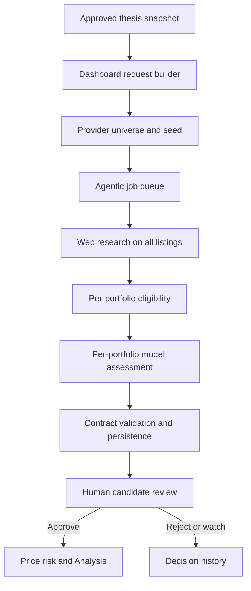
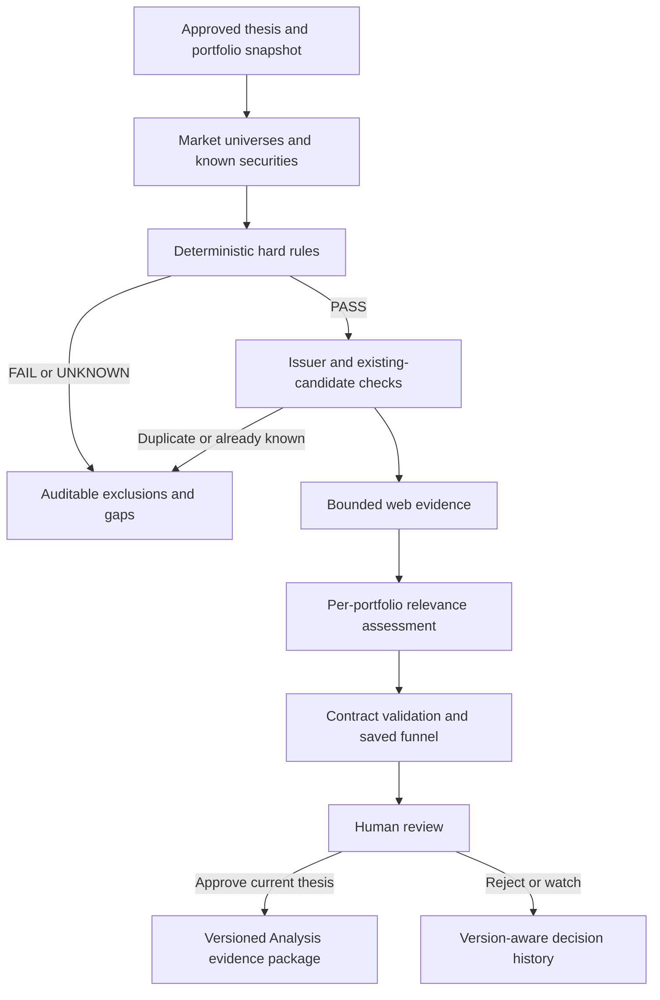

# Discovery audit and implementation — 27 September 2026

## Scope and conclusion

Repository baseline: `cbfd69697516306dc9542fc60bf6eb21b4b3f46d`, including merged Thesis PR #91. This is a source-code audit plus controlled automated validation, not an audit of production provider accounts or live investment results. Confidence is high for the traced code paths and tested invariants; production coverage, latency, billing and financial-data accuracy remain unmeasured.

Discovery should answer **which companies warrant deeper analysis under the approved mandate**. It should establish identity, eligibility, preliminary fit, supporting evidence and unresolved questions. It should not make a purchase decision or pretend to have performed full financial-statement analysis. Preserve the existing human approval gate and limited-data Analysis safeguards.

The existing architecture is useful and does not justify a rewrite. The most consequential defects were research before eligibility, currency used as a geography/eligibility proxy, listing-only deduplication, permanent rejection suppression, no holding/active-candidate context, and all-or-nothing loading of market universes. This change repairs those paths and exposes their results. Full primary-source verification, broad market coverage, normalized financial metrics and durable dispatch remain material work; the complete product Definition of Done is **not yet met**.

## 1. Current architecture and workflow (before this change)

| Stage / implementation | Input and logic | Provider / output / consumer | Failure modes and observations |
|---|---|---|---|
| Thesis / `src/lib/discovery-workflow.ts`, `thesisVersions` | Latest active, owner-scoped version; validates criteria, role and reporting currency | Saved request carries version UUID and full criteria; service consumes it | Superseded version checked under owner lock before dispatch; only Swiss/Brazil equity roles configured |
| Universe / `discovery-provider.ts`, `connectors/eodhd.ts`, `research-universe.ts` | Role → XSWX/BVMF; request 25 records per market; append dated seed listings | Finnhub or EODHD; typed `SecurityUniverseRecord[]` | Cap occurs before thesis filters; seed supplements mean actual count can exceed 25; both markets originally failed if either load failed |
| Queue / `agentic-client.ts`, service `http-server.ts`, `postgres-repository.ts`, `worker.ts` | HTTP job creation; stored payload; worker lease, attempt fencing and retry | Private service database; polled discovery status | POST has 30-second dashboard timeout; remote acceptance/local transaction gap is not solved by owner lock |
| Search / service `web-research.ts`, `discovery-research.ts` | One broad business/risk query per supplied listing, sequential; three results | Brave or Tavily; URLs and snippets | All records researched before screening; no primary-source retrieval route or persistent web cache; `none` returns empty evidence |
| Filter / shared `thesis-domain.ts` | Listing/country attributes, sector/industry, hard numeric rules with exact unit/period | Deterministic eligibility; service consumes eligible rows | Hard unknowns withheld; prose restrictions remain model-reviewed; currency was also incorrectly used as a hard condition |
| Research/ranking / `openai-pipeline.ts`, `prompt-presets.ts` | One structured model response per portfolio; selected identities pinned to provider | OpenAI; rationale, matched/violated criteria, gaps, score, sources | Whole thesis supplied even in isolated portfolio calls; model score has no calibrated decomposition; snippets do not prove claims |
| Import / `synchronizeDiscoveryRun` | Validate version, identity, sources; transactional run and candidate persistence | `externalDiscoveryRuns`, `discoveryCandidates` | Exact listing dedup was global across portfolios; old rejected tickers silently omitted forever for that portfolio |
| Review / `/ai-stock-discovery`, `/api/discovery/candidates` | Latest-run review, source links, evidence counts, decision journal, reject/watch/approve | Decision log; pending → approved/rejected/watchlist | Compact explanation exists, but no auditable hard-filter funnel or rule statuses; pseudo-precise fit score dominates |
| Analysis / `approveCandidateForAnalysis`, `startApprovedCandidateAnalysis` | Durable human approval then daily bars, deterministic risk, grounding bundle, external analysis | Configured price provider; `externalAgenticRuns`, `securityRiskSnapshots` | At least 31 bars; stub rejected; limited-research mode, no invented fundamentals; handoff previously mostly joined prose |

### Inventory and boundaries

- Pages: `src/app/ai-stock-discovery/page.tsx`, `research-history/page.tsx`, `investment-thesis/page.tsx`, `positions/page.tsx`, downstream analysis/report views.
- Components: Discovery page inline cards, `ResearchWorkspace`, `ValuationWorkbench`, decision journal; new `DiscoveryScreeningReview` and `DiscoveryCandidateContext` reuse the existing cards and native disclosure controls.
- APIs: `/api/discovery/preflight`, `/runs` (start/poll/retry), `/candidates` (run-scoped read/decision), `/investor-relations`, `/financial-documents` and approval/PDF subroutes, `/cvm-dfp`, `/financial-report`, `/comparables` plus research/suggestions, `/valuations` plus report. The latter are post-shortlist research/Analysis tools, not universe-generation channels.
- Service API: `/v1/discovery-runs`, individual status and retry; separate Analysis endpoints. Job repository persists payload, result, attempts, progress, failure stage and lease state. Worker refreshes leases and fences completion by attempt.
- Dashboard tables: `thesisVersions`, `portfolios`, `positions`, `securities`, `discoveryUniverseSnapshots`, `externalDiscoveryRuns`, `discoveryCandidates`, `decisionLog`, `marketDataObservations`, `providerCalls`, `externalAgenticRuns`, `securityRiskSnapshots`, valuation/document tables. JSON request/result fields support additive evidence without a relational migration.
- Prompts: immutable discovery instructions plus `AGENT_REASONING_PROMPTS.market_research`, with versioned owner customization. Model output schema deliberately omits service-owned audit fields. Duplicate schema maintenance is intentional for OpenAI Structured Outputs compatibility and covered by schema tests.
- Candidate generation is structured-provider plus curated-seed enumeration followed by semantic assessment. It is not free-form LLM ticker generation. Themes, peer expansion and watchlists are not independent discovery channels today.

## 2. Provider, input and data-quality audit

| Provider / layer | Role and fields | Coverage and freshness | Resilience, cost and remaining gaps |
|---|---|---|---|
| Finnhub | Symbol list: ticker, description, MIC, currency, security type, optional identifiers/classification | Configured `SW` and `SA` mapped to XSWX/BVMF; first bounded records, explicitly unranked | DB gateway tracks calls/budgets; empty/invalid lists rejected; cache then optional EODHD fallback. No measured vendor entitlement, latency, outage rate or price in this audit |
| EODHD | Screener; fallback exchange symbol list and optional bulk turnover; later daily bars/fundamentals | SIX/B3 mappings; turnover-ranked fallback when available; source dates retained | Plan-limit fallback; optional bulk failure becomes labelled unranked universe. Market cap/turnover units and periods need explicit normalized adapters before arbitrary hard metrics can pass |
| Research seed | Dated issuer/LEI/ISIN/FIGI, primary listing, domicile, IR/source URLs; occasional revenue narrative | Snapshot `2026-09-25`; only active primary XSWX/BVMF listings used | No network cost; seed is not live listing verification. Missing classification remains unknown; stale identity/revenue assertions need their own expiry policy |
| Brave / Tavily | Three search URLs/snippets for business, strategy and risks | General web coverage; no assurance of latest financial report or primary evidence | 12-second request deadline, two backoff retries for transient failures; per-security errors isolated. No cross-run cache, quota accounting or automatic provider fallback |
| OpenAI | Portfolio-level semantic selection and synthesis | Only supplied securities may be emitted; structured output and source allowlists | SDK failure classification and job retry; no observed token/cost ledger for Discovery. Score is a qualitative model judgment, not validated investment attractiveness |
| Post-shortlist prices/fundamentals | EODHD and configured price connector, IR/CVM/document workflows | Used during review/Analysis rather than deterministic discovery enrichment | Preserve existing currency and valuation safeguards. Stooq/TwelveData/Yahoo/stub alternatives are price/search infrastructure, not interchangeable Discovery universe providers |

Application defaults are **self-imposed** 60 market calls/minute, 2,000/day, 24-hour plan-limit memory, 168-hour universe fallback cache. These are code settings, not verified vendor quotas. No vendor is classified as deprecated merely because a different provider is configured.

Input problems: only two role markets; no full pagination before thesis filtering; scalar geography fields cannot faithfully represent weighted multi-country exposures; `country` often means listing country; company reporting and revenue-exposure currencies are not first-class metrics. The new filter never infers domicile from `country`, listing, currency or a narrative revenue summary. Exact metric unit/period mismatch is UNKNOWN. Finnhub empty/null numeric fields no longer coerce to zero.

Sector aliases now normalize Tech/Technology/Information Technology and Financial/Financial Services/Financials for constraints. Provider classification remains authoritative, with web classification only when both provider sector and industry are absent. This is a narrow alias map, not a complete GICS/ICB reconciliation service.

## 3. UX, usefulness and output findings

| Feature | Disposition | Finding and action |
|---|---|---|
| Run-scoped review and separate history | Keep | Avoids mixing snapshots; retain existing rejected-candidate history |
| Portfolio preflight and outcomes | Improve | Partial universe outage can now leave the other market runnable; unavailable market is explicitly reported |
| Evidence counts | Keep / improve | Existing text correctly says references are not independently verified facts; dates and provenance now accompany candidates |
| Unexplained numerical fit headline | Replace | Show rationale and matched/violated criteria; retain legacy score internally for compatibility, without asserting calibration |
| Research Story | Merge / improve | New factual screening funnel lives with run outcome rather than adding another competing workflow |
| General research before screening | Remove | Deterministic hard filters and known/duplicate suppression now precede web/model spending |
| Permanent prior rejection exclusion | Replace | Scope rejection suppression to approved thesis version; holdings/active analysis have separate reasons |
| DCF, peers and full financial reports inside Discovery | Keep now; consolidate later | Useful existing functionality, but adds phase confusion. Future Analysis workspace should own it; do not delete working financial tooling in this patch |
| Separate web helpers in dashboard and agentic service | Keep boundary; align policy later | Serve different workflows and credentials; merging implementations across database/service ownership is not justified |
| Raw grounding/debug data | Keep advanced only | Human review uses criteria, sources, dates, gaps and explanations; no new JSON view exposed |
| Additional microservices/universal scoring engine | Do not add | No demonstrated decision value relative to maintenance burden |

The page already has loading/error feedback, readiness check, action disabling and required approval journal. New disclosures expose each considered security's hard rule result and exclusion reason. Small screens use wrapping text rather than a wide mandatory table. Native `details/summary`, headings, links and live progress remain keyboard-accessible. New diagnostic copy is English; localization parity is a backlog item. No audit claims a formal WCAG certification.

Evidence confidence remains distinct from attractiveness: sources and grounding counts describe available references, not quality proof. Search evidence is deliberately `unclassified`; structured known-vendor records are `data_provider`. A `primary` schema category is available but this patch does not promote arbitrary URLs to primary evidence. Publication date may be unknown. Retrieval time must never be presented as the date of a financial fact.

## 4. Implemented architecture

Implementation:

1. `packages/agentic-contract/src/discovery-domain.ts` compiles the existing mandate into a deterministic portfolio-scoped screening snapshot. Rule results include criterion, thesis path, PASS/FAIL/UNKNOWN/NOT_APPLICABLE, reason, source URL and observation date. Preferences/context never exclude.
2. Explicit issuer LEI, issuer ID or issuer key deduplicates eligible records. Primary listing wins, then stable listing sort. Exact exchange/ticker is the fallback; fuzzy names never establish shared ownership. Cross-source missing/inconsistent identifiers remain a limitation. Multiple share classes represent one issuer idea by default; a user-selectable class policy is deferred.
3. Dashboard request includes owner-scoped holdings and prior decisions. Held securities/ongoing analysis suppress repeated suggestions; other decisions apply to the same thesis version. The screening audit distinguishes already-known from ineligible. Suppression is a snapshot, not a permanent issuer blacklist.
4. Market loads use settled results; service keeps independent portfolio outcomes. Reporting currency no longer filters trading currency. No FX calculation was added.
5. Web research runs on the union of eligible, nonduplicate, new listings. No new quantitative LLM calls. One relevance call per researchable portfolio remains. Invalid/missing model output still fails contract validation.
6. Service-owned candidate context includes thesis version, issuer key, eligibility and URL-linked dated snippets. Search snippets retain their matching URL rather than unrelated parallel arrays at the user-facing handoff. Failed research and empty evidence are disclosed separately.
7. Result screening audit records considered listings, eligibility/exclusion reasons, unique research operations, retrieval failures, model calls and elapsed time. Dashboard verifies audit agreement with the saved request before import. Model prompts cannot author these fields.
8. Worker reports screening, eligible research count and portfolio assessment stages; polling exposes progress. Review displays the funnel, rule results, evidence dates and thesis version.
9. Candidate approval checks the active thesis under the same owner advisory lock. A candidate from a superseded thesis cannot be newly approved. Already-started historical Analysis remains tied to its original version.
10. Analysis receives a serialized structured handoff in the existing `GroundingBundle.researchEvidence` contract: run, portfolio, thesis version, listing/trading and reporting currencies, eligibility/provenance context and unresolved questions, alongside existing matched criteria, conflicts, sources and deterministic risk. No second competing Analysis schema or full memorandum generator introduced.

## 5. Prioritized backlog and technical plan

Priority ranks impact on investment correctness first, then user benefit, reliability and implementation cost. Complexity is S/M/L; no fabricated numerical ROI score.

| ID / priority / status | Problem and root cause | Proposed solution | User / investment-process benefit | Components; backend/frontend impact | Complexity; dependencies |
|---|---|---|---|---|---|
| D01 P0 implemented | Trading currency incorrectly acts as mandate geography | Screen listing/explicit geography independently of reporting currency | Correct eligible universe; avoids false exclusions | Shared contract, pipeline, summary; BE logic + FE counts | M; typed mandate |
| D02 P0 implemented | One failed universe provider blocks both portfolios | Independent load results and explicit failed market outcome | Other portfolio remains useful; no cross-market substitution | Workflow/service/contract; BE isolation + FE outcome | M; request failure metadata |
| D03 P0 implemented | Hard constraints applied after research; no auditable per-rule result | Deterministic stage before spending, UNKNOWN explicit, rule/source paths | Understand exclusion and avoid wasted research | Shared domain/service/review; BE+FE | M; Thesis policy |
| D04 P0 implemented | Issuer represented by multiple listings; global listing dedup crosses portfolios | Portfolio-scoped canonical issuer dedup, primary eligible listing | One idea per issuer and independent mandates | Shared domain/workflow/service; BE + FE exclusion | M; explicit issuer identifiers |
| D05 P0 implemented | Historic rejection suppresses forever; holdings/active analyses absent | Version-aware known-security snapshot, separate reasons | Stops repeat noise while permitting a changed mandate | Workflow/shared contract; BE + FE reason | M; owner-scoped queries |
| D06 P0 implemented | Superseded-thesis candidates can be newly approved | Recheck active thesis under owner lock | Prevents accidental approval under obsolete mandate | Approval transaction; BE + existing FE error | S; common lock convention |
| D07 P0 partial | Remote job accepted before local commit; no idempotency key | Durable dispatch/outbox with owner/version/request key, remote uniqueness and reconciliation | Prevent orphan jobs and double research during crashes/retries | Dashboard + service API/DB; BE migration, FE recoverable state | L; coordinated migration and fault-injection tests |
| D08 P0 remaining | Legacy prose exclusions/global constraints are not deterministic predicates | Require structured conversion or explicit unresolved hard-rule workflow before automated eligibility claims | No false certainty about complete mandate compliance | Thesis editor/approval/shared compiler; BE+FE | M; investor clarification; never invent thresholds |
| D09 P1 implemented | Missing scalar values can become zero; sector synonyms differ | Null guard and narrow documented sector aliases; exact unit/period checks | Fewer false numeric/sector conclusions | Provider/shared domain; BE | S; retain original metadata |
| D10 P1 implemented | Evidence loses dates and Analysis lacks context | Service-owned dated sources + saved eligibility package | Traceable review and less repeated downstream research | Web helper/contract/handoff/review; BE+FE | M; JSON compatibility |
| D11 P1 implemented | Opaque score and generic progress obscure decision basis | Rationale-led cards, factual funnel, explicit stage messages | Clear reasons, gaps and scope | Service worker/API/React; BE+FE | M; audit schema |
| D12 P1 remaining | Top-25 truncation precedes thesis screening, causing coverage bias | Paginated cached full symbol universe; cheap categorical screen; transparent research budget after filtering | Better recall without researching every security | Providers/universe builder; BE + FE coverage | L; vendor entitlement, rate tests, typed paging |
| D13 P1 remaining | No primary-source retrieval or claim-level source verification | IR/filing retrieval first, jurisdiction-aware adapters, claim↔document/date references, explicit source hierarchy | Higher confidence in evidence, fewer unsupported narratives | Service research/provider layer + dossier; BE+FE | L; trusted issuer URLs, parser/security review |
| D14 P1 remaining | Financial hard rules often UNKNOWN because normalized metrics absent | Metric observations with value/currency/unit/period/as-of/source; bounded enrichment only when identity/categorical rules pass | Deterministic financial screens without incompatible arithmetic | Contract/provider adapters/compiler; BE + FE data quality | L; accounting/currency metadata, no implicit FX |
| D15 P1 remaining | Seed identities and financial evidence can become stale | Field-level validity/refresh policy, delisting/rename checks, explicit stale/unknown status | Avoid obsolete securities and thesis evidence | Universe cache/identity/evidence; BE+FE | M; freshness requirements by data type |
| D16 P1 remaining | Reproducibility is snapshot-based; model/provider configuration and costs incomplete | Persist prompt/model/reasoning/version, token usage, request counts/retries, provider config hashes and run ledger | Explain changed outcomes and actual spending | Agentic jobs/provider gateway/audit UI; BE+FE | M; SDK usage and billing metadata |
| D17 P1 remaining | Poll errors swallowed; all-failed jobs discard detailed funnel; concurrent known-state changes possible | Store bounded failure diagnostics and screening snapshot before research; atomic dispatch/approval reservations | Actionable recovery and reliable repeat protection | Jobs/workflow/API; BE + FE error state | M/L; D07, migration |
| D18 P2 remaining | Discovery and full Analysis controls share a large page | Dedicated Analysis workspace; keep links and existing data/actions | Less cognitive load, clearer phase purpose | Routes/components; primarily FE | M; preserve URLs and e2e flow |
| D19 P2 remaining | No structured rejection reason or run diff | Reason enum + optional rationale; previous/current issuer and rule/evidence comparison | Faster decisions and explainable changes | Decisions/history/shared types; BE+FE | M; version-aware history |
| D20 P2 remaining | Scalar geography and limited market roles | Explicit exposure sets/weights, security and currency dimensions; provider-backed market registry | Correct multi-country screening and future mandates | Thesis/shared schema/adapters; BE+FE | L; D12/D14, explicit migration semantics |
| D21 P2 remaining | Capacity and selection preferences not reflected in shortlist planning | Show holdings/capacity and configurable oversampling; explain qualitative priority dimensions without false decimals | Manageable optionality and transparent fit | Thesis/run settings/review; BE+FE | M; holdings snapshot; calibrated methodology if scoring added |
| D22 P2 remaining | New diagnostic copy lacks translations; no formal accessibility audit | Localize labels, keyboard/screen-reader and automated a11y review | Consistent multilingual/mobile experience | Translation map/review; FE | S/M; language review |
| D23 P3 optional | No thematic/peer/watchlist generation channels | Add provenance-labelled channels after canonical identity and coverage work | Broader relevant ideas without hallucinated tickers | Generator adapters/review; BE+FE | L; D12/D13 and budget limits |

Implementation order after this PR: D07/D08/D17 correctness; D12/D14/D15 coverage and data; D13/D16 evidence and observability; then D18–D22 workflow. D23 should be justified by measured incremental candidate quality. Do not add a new microservice solely to match the reference architecture.

## 6. Reliability and compatibility limits

- No relational migration in this patch; new optional schemas live in existing JSON. Historical pages can read records without audit/context. Deploy shared contract + agentic API/worker before dashboard sends the additive request fields. Running jobs should be drained or restarted during coordinated deployment because updated deterministic checks may reject results from an older worker.
- Existing candidate uniqueness includes run, portfolio, exchange and ticker. Import remains transactionally idempotent per run, but remote creation is not globally idempotent. Owner advisory locking cannot repair a network-accepted job whose local transaction rolls back.
- Candidate identity is authoritative from provider/seed snapshot, not independently reverified with the exchange. No fuzzy issuer merge. Mismatched identifier coverage across listings can still leave duplicate issuers.
- `knownSecurities` is taken at request construction; it cannot promise serializable protection against a holding added later. Current-thesis rejections retain post-import protection. Existing approved analyses remain suppressed even after thesis changes; explicit reassessment is a future workflow.
- Missing/failed web evidence can coexist with a research lead if disclosed; it is not proof of attractiveness. Every-source failure still fails that market. A partially successful run retains `completed` at job level but failed portfolio outcomes and limitations remain visible; a distinct persisted partial status is deferred.
- Industry normalization, portfolio-wide concentration limits, organic-versus-acquired growth and multi-country exposure predicates are not invented by this patch. Qualitative thesis breakers remain hypotheses until evidence and the original criterion can be connected.

## 7. Validation and quantitative findings

Controlled tests use synthetic securities and mocked provider/model responses. They validate behavior, not real company suitability. No real trades, production data writes or provider-paid research runs were performed.

| Scenario | Evidence |
|---|---|
| Swiss Quality and Brazilian Growth / simultaneous | Domain tests isolate XSWX/CHF and BVMF/BRL; service tests execute separate portfolio model assessments and preserve the successful market on failure |
| Currency/geography | SIX-listed USD-traded fixture remains eligible for CHF reporting; domicile CH, operations BR and revenue US checked independently |
| Hard exclusion / soft preference | Financial Services matches Financials exclusion; missing ROIC preference and CHF context do not reject |
| Missing data / contradictory predicates | UNKNOWN differs from FAIL; exact unit/period required; previous Thesis contradiction tests remain in suite |
| Duplicate / existing holding / repeated run | Explicit issuer ID selects primary eligible listing; portfolio-local known-state suppression; changed thesis permits reconsidering prior rejection |
| Provider and model failures | Partial and total retrieval failure tests; failed market universe isolation; strict model schema and hallucinated identity validation |
| Evidence and handoff | Candidate carries version UUID, rule snapshot and dated URL-linked evidence; handoff serializes those fields using existing Analysis contract |
| Desktop/mobile and approval | Playwright exercises 390px and 1440px; funnel, exclusions, dates, approval journal, Analysis report and existing DCF flow; APIs are mocked |

Focused four-listing fixture: two pass hard constraints, one fails sector exclusion, one is UNKNOWN. The two passing listings share an issuer, leaving one unique research target and one shortlisted candidate. Hard-rule pass rate = 2/4 (50%); unknown rate = 1/4 (25%); duplicate reduction = 1/2 passing listings (50%). Research operations fall from the old four to one (75% reduction); one model call remains. Mock retrieval failures = 0/1. These are deterministic fixture counts, **not production quality or savings estimates**.

A separate full hard-failure fixture performs zero research and zero model calls. Partial-provider tests verify explicit failed outcomes rather than zero-match claims. New run diagnostics record elapsed milliseconds, unique listing research attempts, retrieval failures and model invocations. They do not count HTTP retries, total market API calls or tokens. Average live runtime, live provider failure/missing-data rates and cost per run are unmeasured; report them only after D16 instrumentation and representative live runs.

Validation command results are recorded below after final execution.

Final checks:

- `npm test`: **297 dashboard + 87 agentic tests passed (384 total)**.
- `npm run typecheck`: passed for dashboard, shared contract and agentic service.
- `npm run build`: production build and standalone asset preparation passed.
- `npm run lint`: zero errors; eight existing warnings in unrelated files.
- Full Playwright suite: **6 passed**, including existing Thesis lifecycle and navigation on desktop/mobile. Discovery test also checks the new funnel, explicit exclusions, evidence dates and absence of horizontal overflow at 390px/1440px; a focused final Discovery rerun verifies the final review code.
- Screenshots reviewed at both sizes. Browser API boundaries are mocked; no live database/provider integration or production deployment was tested.
- `git diff --check`: passed.

The four-listing efficiency fixture is reproducible in `services/agentic/tests/discovery-research.test.ts`; deterministic eligibility cases are in `tests/discovery-screening.test.ts`. `tests/thesis-dispatch.test.ts` verifies superseded-thesis approval cannot update the candidate after locking. Existing full workflow browser coverage is extended in `e2e/discovery-workflow.spec.ts`.

## Deliverable map

Architecture/pipeline: section 1. UX, feature usefulness and consolidation: section 3. Thesis/universe/provider/input/financial normalization findings: sections 1–2. Screening, identity, ranking, research evidence and Analysis handoff: sections 2–4. Reliability/performance/cost: sections 5–7. Prioritized backlog and dependencies: section 5. Future architecture, technical implementation and actual changes: section 4 plus `discovery-contract-proposal.md`. Validation and measured limitations: section 7. The backlog explicitly distinguishes completed work from remaining requirements; no live candidate-quality uplift or full-market search is claimed.
