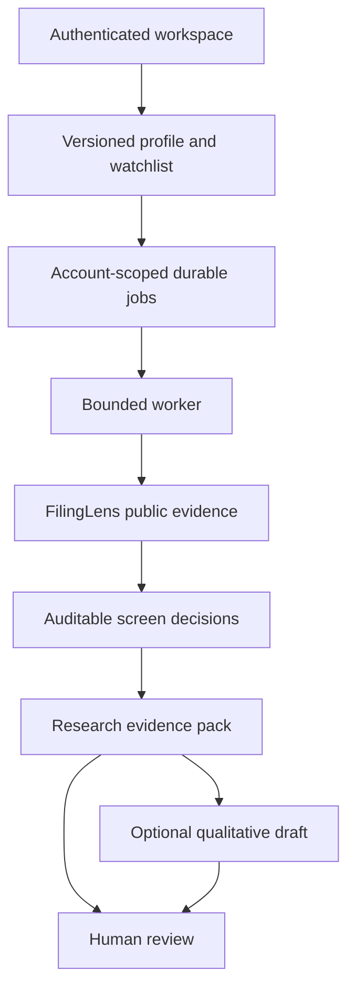

# Replacement foundation — USA/SEC and Brazil/CVM

User-authorized scope: replace Global-portfolio-intelligence only; leave FilingLens unchanged. Git history and existing database records are preserved. Local checkpoint `aafde3d` retains the preceding application plus unfinished integration work; remote recovery branch preserves main at `1c6e816`.

## 1. Dependency mapping and risk analysis

Hard boundaries: only us/br and allowed listing exchanges; no Swiss adapter; no portfolio calculators; financial indicators are externally supplied; no order tools or automatic approvals. Existing sessions remain revocable and MFA remains enforced. Tenant identity comes from authenticated membership, never a request payload. Candidate evidence and model text are untrusted.

Principal risks: incomplete FilingLens API availability, stale/ambiguous identifiers, unsupported liquidity/valuation inputs, model claims not entailed by cited facts, worker crash after a paid request, and auto-deployment of obsolete services. Unknowns are disclosed rather than silently treated as passes.

## 2. Architecture proposals

| Candidate | Feasibility / cost per execution | Latency / safety / verification |
|---|---|---|
| Implemented deterministic workflow plus optional single generator | Existing Next/Postgres; zero model calls for screens/evidence packs; at most one model call for optional draft. Twenty candidates, forty context facts, bounded context and two thousand completion tokens. | One worker per deployment, sequential candidates, six-second per-finance-read deadline; leased durable state. Test deterministic decisions, tenant boundaries, expiration and draft rejection. |
| Existing supervisor/specialist runtime | Could reuse its complex topology, but retained internal financial logic conflicts with requested ownership unless extensively stripped. More model calls and larger coordination surface; no reliable relative price estimate without workload. | Additional critical-path calls, context and approvals; needs measured ablation and numerical ownership tests. Useful only if coverage gains justify cost. |
| Full ZIP framework stack | Technically possible, but requires provider credentials, cross-framework identity/data contracts and more operational services. More dependencies and potentially many calls. | Greater queue/provider contention and tool-risk surface. Requires equivalent-case benchmarks, grounded claim audits and framework isolation. Deferred. |

Monetary cost and production p50/p95 are unknown because model, price, traffic and source availability are not established. Resource caps are implemented; savings are hypothesized, not measured. One draft request is not a guarantee of useful output within its token cap.

## 3. Comparative pros and cons

| Attribute | Implemented foundation | Prior runtime | Full ZIP imports |
|---|---|---|---|
| Finance boundary | Explicit external-only | Duplicated financial calculations | Requires extensive adapter replacement |
| Maintainability | Small, typed surface | Many interconnected modules | Multiple languages/frameworks |
| Research coverage | Evidence pack; optional qualitative hypotheses | Richer existing specialist coverage | Potential broader coverage, unbenchmarked |
| Model economics | Zero/one bounded call, modeled cap | Workload-dependent | Workload-dependent, unmeasured |
| Main drawback | Starter universe and limited indicator contract | Complexity and inconsistent ownership | Provider/licensing/operations burden |

Acceptance criteria: no active quant/fx/valuation modules; no Swiss candidates accepted; missing evidence never passes; source identity/hash verified; cross-account rows inaccessible; repeated idempotency keys cannot duplicate work; stale workers cannot overwrite terminal records; UI works at mobile/desktop sizes.

## 4. Recommended architecture

The implemented foundation matches the user's instruction to replace GPI now and improve later. The skill's simplest-baseline principle resulted in one durable worker and one optional generator, rather than importing every ZIP agent. Typed deterministic gates do not need model judgment. Bull/bear research is a perspective within one call, not added autonomous agents.

Trigger an additional worker only after queue-wait p95, runtime occupancy, delayed screens during research and demand justify another service. Production metrics are not yet collected. Deeper research requires labeled semantic-quality evaluation before more debate or personas are enabled.

## 5. Implementation blueprint

- Dashboard: profile/candidate import, screening launches, retained reports and activity; same-origin authenticated API. Viewer memberships cannot write. Public health endpoint exposes no secret or database content.
- PostgreSQL: `gpi_foundation_workspaces` and immutable-input `gpi_foundation_jobs`, additive migrations, per-account idempotency/advisory lock, three active and twenty-five daily requests per account. Terminal results are not edited through application APIs.
- State machine: queued → running → complete/failed. Claim uses row locking with SKIP LOCKED. Lease is one hundred eighty seconds. Expired running jobs fail; they are never automatically replayed because a paid request may already have occurred. Queued jobs expire after an hour when the worker resumes.
- Worker: one job at a time; at most twenty candidates; sequential reads; run-budget check before each candidate. Models use a separate thirty-second deadline, no retry, no tools. Store outages back off; SIGTERM stops claiming new jobs and lets in-flight work finish if the platform grace period permits.
- Finance connector: HTTPS origin, dedicated server token, public-only GET, no redirects, two attempts total under six seconds, two hundred fifty-six KB response cap, canonical issuer and SHA-256 content check, official regulator sources. Retried network/transient requests cannot write to FilingLens.
- Screens: profile market gate, externally supplied annual growth comparator and fiscal evidence freshness, explicit unavailable liquidity/objective gates. No prices, valuation, risk, FX or indicator derivation.
- Research: original ZIP-inspired evidence/counterevidence policy; supplied fact IDs only; null/conflicted facts cannot support model claims; digit/currency-symbol generated numerical claims rejected. This syntax gate does not catch every spelled-out or semantically unsupported claim: human review remains mandatory. All received source values are rendered separately.
- Trace: persisted input/profile/evidence snapshots, source references, start/finish timestamps, lease identity, architecture/version, run elapsed time, model configuration/returned usage and stop reason. Worker logs redact secrets, payloads and account identities. Exact monetary attribution is not implemented without verified prices.
- Deployment: dashboard standalone build plus foundation worker. Retire old agentic API, worker configuration and filings-python before main cutover. No Railway service or secret was changed during implementation. FilingLens producer deployment and finance token provisioning are separate prerequisites.

## 6. Verification plan

Tests cover source contract corruption, unofficial URLs, insecure transport, size/retry bounds, USA/CVM validation, profile and job limits, empty thresholds, stale/future/conflicted data, unsupported model references/numbers, account isolation, SQL idempotency/leases and browser journeys.

SQL tests execute the actual statements on embedded PostgreSQL through a test transport adapter, including the additive migration twice. They do not prove native multi-replica contention or production connectivity. Browser tests mock signed-in API data, never display fixtures in production. No paid model or provider request is made.

Release gate: lint, types, unit/SQL/security tests, worker build, production web build and mobile/desktop browser smoke; then GitHub CI. Production cutover additionally requires a staging migration on a database copy, valid existing login/MFA, native concurrent-worker test, actual FilingLens read and Railway service alignment. No merge/deployment success should be inferred from a local build.

Next measurable experiments: authenticated SEC and CVM reads; labeled identity coverage; twenty representative screening cases; at least five repeated optional-model runs per case and qualitative claim audits; outage/lease failure injection; queue wait and runtime histograms; model usage/cost per successful report. Compare any future debate/persona framework on the same evidence and resource budget, with ablation.

Recommendation confidence: 4/5. Live production confidence: 2/5 until cutover checks are complete. The largest gaps are deployed FilingLens capabilities, verified Brazil CNPJ mappings and production worker/service configuration.

References: [ZIP provenance](zip-provenance.md), repository implementation and tests, [official Chat Completions reference](https://developers.openai.com/api/reference/resources/chat/subresources/completions/methods/create), [PGlite API](https://pglite.dev/docs/api).
