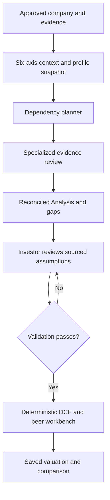

# Market-adaptive Analysis

## Scope and source

Implementation of the uploaded `market_adaptive_factory.zip`, adapted to the existing TypeScript dashboard and separately deployed agentic service. The Python files are a prototype, not a deployable service: agent factories are undefined, trigger expressions use `eval`, and sorting names does not resolve dependencies. We retain the architecture and replace those mechanisms with typed contracts and deterministic dispatch.

## Before and after

| Area | Existing system | Change |
|---|---|---|
| Thesis / Discovery | Approved thesis snapshots, screening, evidence, candidate approval | Keep; extend the approved candidate research package |
| Analysis | One generic model response plus synthesis | Specialized evidence modules followed by the existing synthesis |
| Market identity | Country, exchange, trading currency | Six independent, source-linked market dimensions |
| Financial calculations | FCFF derivation, ratios, three-case DCF, peer multiples | Reuse; add CAPM/WACC, real-rate conversion, CRP, beta re-levering and general FCFF/FCFE primitives |
| Valuation approval | Filing and forecast review | Add market completeness, sourced capital inputs and computed base WACC |
| Research display | Narrative, scores, gaps, PDF | Add profile versions, module results, scenario-linked risks and conflicts |
| Persistence | Request/manifest JSON and immutable valuation rows | Add typed snapshots inside existing records; no destructive migration |

The six dimensions are incorporation country, listing exchanges, financial reporting currency, accounting standard, revenue geography and regulatory jurisdictions. Domicile, listing country, trading currency and financial reporting currency are not inferred from one another. Universe attributes use `incorporation_country`, `reporting_currency`, `accounting_standard`, `regulatory_jurisdiction`, and JSON `revenue_geography` (`country`, decimal `share`). Missing values stay unknown.

## Components

- `packages/agentic-contract/src/market-adaptive.ts`: Zod contracts, immutable built-in US/BR/CH profiles, registry, triggers and topological planning.
- `packages/agentic-contract/src/market-profile-loader.ts`: server-only, validated deployment YAML loader.
- `packages/agentic-contract/src/market-engines.ts`: independently testable math, freshness/range checks, peer deduplication and reconciliation.
- `services/agentic/src/market-orchestrator.ts`: module dispatch, dependency failures, evidence validation and conflict retention.
- `services/agentic/src/openai-pipeline.ts`: structured specialist outputs and final synthesis. Model output cannot supply the server-owned execution report.
- `src/lib/discovery-workflow.ts`, `src/lib/integrations/grounding-builder.ts`: capture profile configuration in approved request bundles.
- `src/app/api/discovery/valuations/route.ts`: source/period/identity checks, market validation, WACC enforcement and persisted capital results.
- `src/app/api/discovery/comparables/route.ts`: issuer deduplication and retained profile policies.
- `src/components/market-analysis-review.tsx`, `market-assumptions-review.tsx`: review of identity, assumptions, missing information and actual execution results.
- `services/agentic/src/pdf.ts`: market review in the exported Analysis report.

All model calls remain in the agentic service. The dashboard's calculation modules make no external or model calls. Zod replaces Pydantic to avoid introducing a second runtime.

## Market profiles and configuration

Built-in profiles cover US, Brazil and Switzerland. `config/market-profiles/*.yaml` contains their deployable equivalents. No rate, tax or risk-premium estimate is embedded as an automatically usable valuation input.

To add a market without changing dispatch code:

1. Copy a YAML profile and set a unique `id`, version, country, exchanges, accounting standards and currency.
2. Review its accounting, macro, tax, risk-free-rate and peer policies with the investment owner.
3. Select mandatory/optional/excluded modules. Optional entries define availability; `triggers` and the core exposure rules activate optional work.
4. Use typed triggers such as `{ agent: CommodityFXAgent, field: exportRevenueShare, greaterThan: 0.4 }` or `{ agent: MarketMacroAgent, field: sector, includesAny: [Utilities] }`. No executable expressions are accepted.
5. Mount the directory in the dashboard and set `MARKET_PROFILE_DIR` to its absolute path. New requests load it at runtime. No code rebuild is required for an already mounted directory. In immutable deployments, a changed deployment asset still needs deployment.

Invalid/empty configuration fails explicitly. Unknown fields, duplicate IDs within the directory and changes to built-in content without a version increment are rejected. Files are bounded to 128 KiB, at most 32. Use deployment-managed files, never uploads from an unauthenticated user. Custom YAML is data only and uses the parser's JSON schema.

Analysis bundles contain the complete profile snapshot. The service and callback validator use that snapshot, so changing the deployed directory does not reinterpret in-flight or historical work. Each valuation also stores the selected policy objects and versions. Keep published versions immutable; bump the version whenever policy changes.

Profiles are selected by listing, incorporation, regulation or material revenue exposure (>40%). Currency and accounting are independently validated rather than used to guess jurisdiction. Hybrid issuers retain every applicable policy; they do not get a blended currency discount rate. Country risk is reviewed for BR or non-US/CH revenue exposure. Commodity/export triggers are explicit heuristics (>30% commodity or >40% exports, plus relevant sectors), not estimates of financial exposure. A new market with different routing requirements can declare additional typed triggers.

## Execution and evidence

The registry contains Financial Statement, Market Macro, Country Risk, Sector, Commodity/FX, Forecasting, DCF, Peer Valuation and Risk modules. Dependencies are resolved topologically. Forecasting waits for financial, sector and activated exposure modules. Risk reconciliation may run with incomplete dependencies so it can report missing evidence.

Deterministic price-risk and financial results enter the bundle before interpretation. Every specialist claim cites an existing evidence key; every risk also names a scenario and assumption. Unknown citations, malformed responses, contradictory completion states and provider errors are recorded explicitly. Failed required predecessors block dependent work. Opposite directions for the same scenario/assumption produce a retained conflict rather than an arbitrary winner.

The DCF module does not invent forecasts during initial research. It records valuation readiness; the existing, investor-approved workbench executes the deterministic engine after reviewed input is available. An Analysis report with missing statements can still be produced, but is visibly incomplete and cannot unlock valuation.

This distinction is intentional: schema-valid model findings are interpretations of supplied evidence, not independent verification that a cited source proves the claim. Primary-source ingestion remains the existing filing/research process. A source URL supplied in an assumptions memo is investor provenance, not a claim that this change fetched or verified that URL.

## Corrected valuation conventions

Several prototype formulas/defaults required correction:

- Default-free rate and cash flows must use the same currency and real/nominal basis. An NTN-B yield cannot automatically discount nominal BRL forecasts. The reviewed rate must first exclude sovereign default risk; a real rate is converted with `(1 + real rate) × (1 + expected inflation) − 1`.
- Cost of equity is default-free rate + beta × mature-market ERP + explicitly reviewed company-exposure CRP. It is not a weighted average of currency-specific WACCs.
- Country-risk engine uses a dated sovereign spread × observed relative equity/bond volatility. No indicative rating table is silently dated today. Corporate interest coverage is not a sovereign rating.
- Debt yield that already includes sovereign risk does not receive CRP a second time. Debt without sovereign exposure needs an explicit sourced additional spread, including zero where justified.
- Tax is a sourced company-specific input. The US and BR prototype defaults are policy considerations, not universal tax assumptions.
- FCFE directly values equity and does not subtract net debt again. FCFF and FCFE exit multiples are checked for consistency.
- Explicit cash flows support mid-year discounting; terminal value is discounted at year end. The existing workbench retains its year-end convention.
- Terminal growth must be below the discount rate. Finite amounts, positive shares and supported rate ranges are enforced.

Method references reviewed during implementation:

- [Damodaran: risk-free rates and cash-flow basis](https://pages.stern.nyu.edu/adamodar/New_Home_Page/valquestions/riskfreerates.htm)
- [Damodaran: country premiums and sovereign spreads](https://pages.stern.nyu.edu/~adamodar/New_Home_Page/datafile/ctryprem.html)
- [Damodaran: company exposure to country risk](https://pages.stern.nyu.edu/adamodar/New_Home_Page/valquestions/a19.htm)

Rates/debt yields/inflation must be nonfuture and at most 31 days old; ERP/CRP/beta/tax/weights at most 366 days old. These are visible system freshness policies, not assertions that these inputs change on those schedules. The form accepts a dated research memo that documents every source. The API supports a separate date/reference on each number.

## DCF and peer workflow

The investor verifies missing market dimensions, supplies capital assumptions, reviews FCFF and forecasts, then confirms. The computed base WACC is read-only in the form and checked again server-side. Worst-case WACC cannot be lower than base; optimistic WACC cannot be higher. A changed filing period, currency, listing, sector or profile snapshot invalidates the review.

The general engine supports FCFF and FCFE and Gordon/exit terminal values. The deployed three-case UI remains an FCFF workbench. Banks/insurers remain blocked there until a separately reviewed FCFE/DDM or excess-return workflow exists; the new primitive does not imply that workflow is deployed. A reporting/trading-currency mismatch also blocks this workbench until an explicit financial translation is supplied through a separately supported workflow. No silent FX conversion is introduced.

Peer approval retains the existing 6–10 peer minimum rather than weakening it to the prototype's 3–4. Explicit issuer identifiers, repeated ticker and normalized exact company names identify duplicates. This is conservative duplicate protection, not a universal issuer master: different names without a shared identifier require human review. Each peer retains its own currency/period and source. Only dimensionless multiples cross peer currencies. DCF/peer disagreements above 35% are review warnings, not blended target prices.

## Rollout and rollback

1. Build and deploy the shared contract and agentic service first.
2. Deploy the dashboard with matching contracts. Existing profile defaults need no environment change. Set `MARKET_PROFILE_DIR` only when managing custom profiles.
3. Exercise approved-candidate Analysis and a sourced valuation in staging.
4. Monitor specialist failures, duration and model usage. Up to eight specialized reasoning calls plus final synthesis may run per security; unavailable financial evidence skips dependent modules. Existing worker lease renewal continues throughout.

No database migration is needed: optional contract fields are stored in existing JSON snapshots. Old records remain readable by the new release. A rollback to an older strict-schema service must drain new-format jobs first; older code cannot be assumed to accept added fields.

## Validation and remaining boundaries

Unit/API tests cover US, Brazilian commodity, BR/US hybrid and Swiss routing; unsupported IFRS-only jurisdictions; sourced real/nominal conversion; stale/missing CRP; debt double counting; hand-calculated WACC and FCFF/FCFE; duplicate peers; provider/citation failures; dependency order; scenario conflicts; immutable configuration; filing/identity gates and persisted review evidence. Browser tests cover approval through the assumptions form, computed WACC, DCF save and report access at mobile and desktop widths.

Live paid-provider calls, jurisdiction-specific accounting normalization and automatic macro-series ingestion are not supplied by the ZIP and are not simulated as production-ready here. Their absence is surfaced as missing evidence or a required sourced review. No claim is made that generic evidence interpretation constitutes audited financial normalization, or that this Analysis change completes every earlier Discovery Definition of Done item.

### Verified locally (2026-09-28)

| Check | Result |
|---|---|
| Dashboard/shared unit and API tests | 316 passed |
| Agentic-service tests | 96 passed |
| Playwright workflows | 6 passed, including 390px and 1440px |
| Type checking | Passed for dashboard and service |
| Production build | Passed, including standalone assets |
| ESLint | No errors; 8 existing warnings outside this change |
| Production dependency audit | 0 vulnerabilities |

Browser workflow requests use fixtures; they verify interface behavior and submitted contracts, not a live database or paid market-data/LLM provider. API/domain tests separately exercise validation and persistence payloads. Live staging-provider verification remains a deployment check.

Input archive SHA-256: `63caa0bea4fee040e587793f6eb9d363b1b13b4e71d82f40b60260f81a7ce295`.
