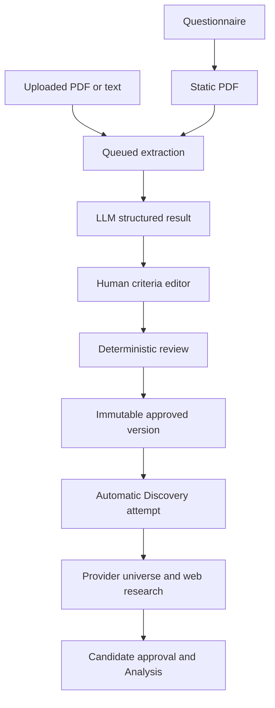
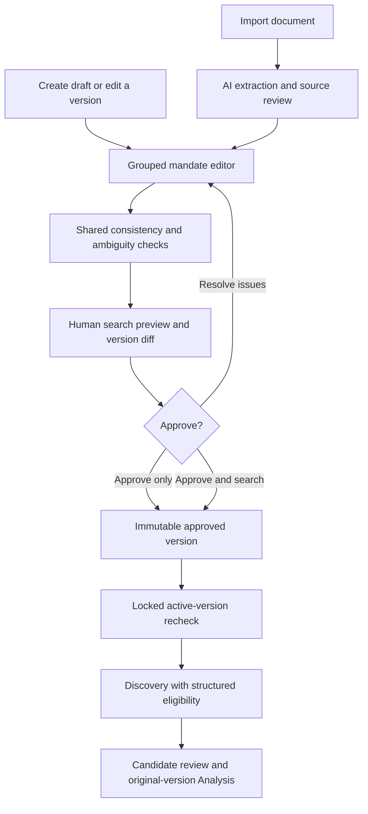

# Thesis phase audit and implementation

Audit base: `0da2f10234a705deb76b9cb2fd5c740e546165bc` (main, 27 September 2026).
Confidence: 4/5 for code findings and tested behavior. Live production data, provider coverage, concurrent database behavior under load and actual investor intent were not independently verified. Findings below come from repository inspection, not an assumption that every requested feature was previously absent.

## 1. Current state before this change

The dashboard generates a static PDF or accepts a validated PDF/text/Markdown upload. `/api/integrations/agentic/thesis-extractions` stores an owner-scoped extraction job and calls the separately deployed service. Service parsing supplies the requested version, objective, currency, inclusion/exclusion arrays, target metrics, confidence, ambiguous source excerpts and unmapped content. The browser polls pending jobs. A user edits the result and confirms it through `/api/thesis`.

Confirmation already uses an owner advisory transaction lock, sequential version checking, immutable `thesis_versions` records, supersession and `thesis_mutation_audit`. Extracted ambiguity requires a review note. Confirmation then independently attempts Discovery; failure does not roll back the approved thesis. Existing run request JSON stores the exact thesis version and criteria. Analysis reads the candidate run's original thesis, preserving history.

### Implementation inventory

| Layer | Existing components / responsibilities |
|---|---|
| Page | `src/app/investment-thesis/page.tsx`: questionnaire, import, extraction queue, review, confirmed versions |
| Editor | `src/components/thesis-criteria-editor.tsx`: role, currency, objective, prose lists, existing metrics |
| APIs | `src/app/api/thesis/route.ts`; `src/app/api/thesis/generate/route.ts`; `src/app/api/integrations/agentic/thesis-extractions/route.ts` |
| Domain | `thesis-review.ts`, `thesis-currency.ts`, `thesis-portfolios.ts`, `thesis-generator.ts`, `thesis-extraction-lifecycle.ts`, `services/thesis-exclusion.ts` |
| Canonical schema | `packages/agentic-contract/src/index.ts`: ThesisCriteria, ThesisPortfolioCriteria, ThesisExtractionResult, DiscoveryRunRequest |
| Persistence | `src/lib/db/schema.ts`: thesisVersions, portfolios; `workflow-schema.ts`: externalThesisExtractions, thesisMutationAudit, externalDiscoveryRuns, discoveryCandidates |
| Service | `services/agentic/src/openai-pipeline.ts`: extraction model schema, immutable prompts, normalization, Discovery model, output validation; service repository/worker lifecycle |
| Handoff | `thesis-discovery-transition.ts`, `discovery-workflow.ts`, `integrations/agentic-client.ts`; provider universe + request snapshot |
| Geography evidence | `research-universe.ts`: separate issuer domicile and listing attributes, dated revenue narrative; operating/revenue numeric coverage is incomplete |
| Existing tests | `tests/thesis-*`, `tests/discovery-*`, service schema/research tests, `e2e/thesis-review.spec.ts` |

No evidence supports deleting the extraction service, audit log or historical snapshots. The questionnaire/PDF path is useful for exporting a document, but is unnecessarily expensive as the only construction path. Role slugs and primary JSON export impose technical burden. Generator and review forms duplicate mandate input. Existing `ThesisSummary` has unused editing props; removing them is low priority and unrelated to eligibility correctness.

## 2. Input architecture assessment

| Input | Purpose / effect | Required? | Treatment and validation |
|---|---|---|---|
| Portfolio name | Human identification | Useful, optional | Added structured name; do not infer security selection from name |
| Destination | Select supported Discovery market | Yes | Existing role retained; friendly selector shows SIX/B3; other imported mandates remain readable |
| Objective | Investor mandate | Yes | Nonblank; never generated as a replacement for investor intent |
| Strategy | Review context | Optional | Structured named field; qualitative description, not automatic thresholds |
| Reporting currency | Native portfolio accounting | Yes | Existing normalization and configured CHF/BRL checks retained; not a geography proxy |
| Benchmark | Performance reference | Optional | Recorded; no invented default benchmark |
| Horizon | Investment time frame | Optional | Recorded explicitly; possible catalyst mismatch is advisory |
| Target / maximum holdings | Portfolio construction limits | Optional | Positive integers; target cannot exceed maximum. Research shortlist cap is distinct |
| Domicile | Issuer legal home | At least one geography dimension for new policies | ISO alpha-2; matches explicit issuer evidence only |
| Listing market | Tradable venue | Same | MIC; no inference from domicile. Current implementation searches BVMF/XSWX only |
| Operating geography | Business operations | Optional | Separate restriction; missing explicit evidence is unverified |
| Revenue exposure | Sales geography | Optional | Separate restriction; narrative revenue summaries cannot establish numeric exposure |
| Security types | Eligible instrument classes | Optional | Provider label matching, not guessed normalization |
| Sector / industry inclusion and exclusion | Universe restriction | Optional | Exact case-insensitive comparisons; identical inclusion/exclusion blocked; unknown classification does not pass |
| Market cap / liquidity | Size / tradability | Optional | Explicit metric predicate with currency/unit and period. No default cutoffs or currency conversion |
| Growth, ROIC, incremental ROIC, FCF conversion, leverage, margins, stability | Company selection | Optional | Classified rules; numeric predicates require explicit field, comparator, threshold, unit and period |
| Competitive advantage / management / durability | Human judgment | Optional | Qualitative preference or hard rule; vague statements shown with interpretation and possible proxies, never arbitrary thresholds |
| Interest rates, inflation, FX, GDP, commodities, regulation, country risk, structural themes, cyclical/secular exposure | Macro/sector reasoning | Optional | Rule category + hard/preference/context classification. Context never screens candidates out |
| Risk / valuation preferences | Mandate trade-offs | Optional | Same classified rule model; comparable numeric lower/upper contradictions blocked |
| Legacy inclusion/exclusion, targetMetrics, globalConstraints | Preserve source/old mandates | Backward-compatible | Retained as prose, explicitly flagged for review; not misrepresented as deterministic predicates |
| Review decision | Record investor judgment | Required for flagged ambiguity | At least 20 characters; preserved with original extraction and confirmed criteria |
| Investor name / title / review cadence | PDF presentation | Optional direct path | Retained in optional document builder, no longer mandatory to draft a mandate |

Mandatory structure is intentionally small: objective, destination, reporting currency, and at least one geography dimension for a structured policy. Empty optional fields do not acquire fabricated defaults. Field presence alone does not prove a provider can supply the necessary evidence.

## 3. Findings and prioritized backlog

Priority balances investment value, UX impact and reliability against implementation complexity. P0 means correctness/integrity, P1 high value, P2 useful enhancement, P3 optional. Status is explicit; deferred work is not presented as implemented.

| ID / priority / status | Problem → solution | User / investment-process benefit | Affected components; frontend/backend impact | Complexity / dependencies |
|---|---|---|---|---|
| T01 P0 Implemented | Mixed prose has no hard/soft/context contract → optional typed policy with explicit effects | User sees search interpretation; context cannot become an automatic exclusion | Shared contract + policy editor + service prompts and gate; both | Medium; coordinated dashboard/service deploy |
| T02 P0 Implemented | Geographic concepts easily conflated → separate domicile/listing/operations/revenue fields | Prevents selecting a business solely because currency or exchange appears domestic | Shared domain, editor, preview, service; both | Medium; explicit provider evidence |
| T03 P0 Implemented | Known numeric conflicts not validated → same metric/unit/period bounds, holdings and sector/industry checks | Clear corrections; stops impossible mandates | Shared domain + review/API; both | Medium; typed fields |
| T04 P0 Implemented | Previously loaded or explicitly requested superseded thesis could dispatch → active-version filter and locked recheck after provider loading | Search starts from an approved active snapshot | Discovery workflow; backend | Medium; existing owner lock shared with approval/exclusion |
| T05 P0 Implemented | Missing hard-rule data could appear eligible → eligible/ineligible/unverified evaluator at model input and output validation | Unknowns do not become certified matches | Shared contract + service; backend, limitations output | Medium; can reduce shortlist to zero where provider data are insufficient |
| T06 P1 Implemented | PDF round trip required for first draft → direct authoring path | Less waiting and repeated interpretation | Thesis page/editor; frontend, existing POST | Medium; no synthetic extraction records |
| T07 P1 Implemented | Review ambiguous prose without explicit interpretation → issues show original statement, reason, effect and possible proxy | Investor can correct intent; no invented metrics | Shared review + UI + API acknowledgment; both | Medium; deterministic lexical detector is deliberately limited |
| T08 P1 Implemented | Approval implies immediate research → approve-only and combined action | Explicit control; saved thesis survives provider outage | Page + POST; both | Low; backward-compatible default for existing clients |
| T09 P1 Implemented | Existing versions could only be removed/exported → edit as new version and field-level diff | History remains auditable; rerun expectation visible | Page + API baseVersionId check; both | Medium; existing immutable JSON |
| T10 P1 Implemented, bounded | Unsaved review state lost on reload → owner-scoped, versioned, schema-checked tab recovery; failed-save notice | Protects incomplete edits; no hidden server-save claim | ThesisDraft schema + page; frontend | Medium; browser storage availability; not cross-device persistence |
| T11 P1 Implemented | Race during approval / double click / opaque errors → busy fieldset, submission guard, exact error messages, stale-base rejection | Failed save preserves edits; duplicate approval cannot silently create a new version | Page + API; both | Medium; immutable sequential version gate |
| T12 P1 Implemented | Internal slugs/JSON dominate UI → destination labels, grouped sections, optional PDF builder and advanced JSON export | Clearer human review with less initial cognitive load | Page/editor/preview/CSS; frontend | Medium; preserves current styles |
| T13 P1 Deferred | Remote job accepted but local insert fails → durable outbox + remote idempotency key | Removes the remaining distributed orphan/duplicate-job failure window | Dashboard DB, agentic API/repository; backend | High; cross-service migration and retry/reconciliation design |
| T14 P1 Deferred | Provider universe lacks normalized fundamentals and many geography facts → provenance-aware enrichment | Makes hard metrics practically usable instead of returning unverified | Provider gateway, issuer/listing database, financial ingestion; backend | High; licensed data coverage, currencies, fiscal periods, freshness policy |
| T15 P2 Deferred | Draft recovery limited to current tab → owner/actor-scoped server drafts with revision CAS | Resume across devices and collaborate safely | New draft table/API and UI; both | Medium; explicit migration and retention policy |
| T16 P2 Deferred | Existing candidates not automatically reassessed after a new mandate → compatibility report against immutable original evidence | Identify which prior candidates need new research | Candidate review + shared evaluator; both | Medium; no claim that historical evidence is current |
| T17 P2 Deferred | Positional diff noisy on reorder → stable criterion IDs and semantic diff | Easier review of large edits | Contract + editor/diff; both | Medium; schema evolution and imported rule identity |
| T18 P2 Deferred | Broad macro language cannot be fully understood by lexical checks → advisory AI critique with source-linked proposed edits | Better coverage of nuanced tensions while preserving intent | Existing agentic service + review UI; both | Medium; output schema, opt-in acceptance and evaluation set |
| T19 P3 Deferred | Questionnaire and editor still overlap → unify optional PDF export around approved structure | Less maintenance; consistent printable document | Generator/PDF renderer; both | Medium; preserve current PDF output compatibility |
| T20 P3 Deferred | Existing summary carries unused currency-edit props → simplify component | Small maintenance benefit | Page summary; frontend | Low; no investment-process impact |

## 4. Keep / improve / consolidate / remove / replace

| Existing feature | Decision | Rationale |
|---|---|---|
| PDF/text import and validated extraction | Keep | Supports investor-authored documents and source audit |
| Model confidence | Keep with limitation | Extraction confidence is not correctness or investment confidence |
| Source excerpts and unmapped content | Keep / improve | Remain visible; supplemented with shared deterministic issues |
| Immutable versioning + owner locks | Keep / improve | Correct foundation; extend locks to dispatch, add stale base check |
| Prose-only selection model | Improve | Preserve history; offer typed policy without destructive migration |
| Mandatory questionnaire→PDF→LLM path | Replace as default | Direct structured drafting avoids redundant interpretation |
| Large permanently visible questionnaire | Consolidate visually | Optional collapsed document builder; mandate editor is primary |
| Confirm-and-start | Improve | Retain convenience plus separate approve-only action |
| Primary JSON export | Move to advanced | Normal readers see human summaries and search preview |
| Exclusion of historical versions | Keep | Existing audited behavior; no data erasure introduced |
| Additional autonomous strategy-writing agent | Do not add | Would not resolve missing investor intent reliably |
| Silent automatic numeric interpretations | Do not add | Violates investor control and creates false precision |

## 5. Future-state workflow implemented

Grouped expandable sections were preferred over an eight-screen wizard: there is already a working extraction/review surface, and investors need to compare related rules without navigating away. The initial optional questionnaire is collapsed, while mandate, universe and classified rules remain reviewable together. Standard HTML labels, fieldsets, summaries, focus outlines, responsive columns, busy states and live messages preserve keyboard/mobile access.

## 6. Contract and deterministic behavior

The existing `ThesisPortfolioCriteria` gains an optional `policy`. Stored legacy JSON remains valid. Policy consists of mandate metadata, `universe`, and classified rules with optional explicit numeric predicates. `thesisDiscoveryPlan` projects this into hard constraints, preferences, contextual assumptions, legacy content and actual supported-market coverage. It is used by the human preview and included in the service prompt. No separate authoritative prose/JSON model is introduced.

A populated universe field is a hard restriction. Values within a field use OR; separate fields use AND. Metric predicates require an exact provider field, numeric value, matching unit and period attributes. Missing or mismatched units are unverified. Sector/industry classifications are never guessed for deterministic filtering. Operating/revenue fields currently require explicit scalar ISO evidence; narrative region summaries or percentages are not parsed into facts. More expressive revenue-share predicates depend on normalized provider data and are not claimed here.

The service only sends candidates with verified structured eligibility to the model and independently validates returned candidate eligibility. Preferences and context never reject. Legacy prose exclusions still receive evidence-based model review; they are not falsely described as deterministic. Newly approved legacy prose requires a review disposition. Historical versions are readable and are not silently rewritten with inferred policies.

Current provider routing remains B3/BRL and SIX/CHF native-currency listings. Separating geography does not expand market coverage or permit mixed-currency calculations. Unsupported mandates and missing evidence are explained, not silently broadened.

## 7. Versioning and reliability

Every approval creates a new snapshot. The next version number is read across all versions, including excluded ones. `baseVersionId` checks whether the active version changed while editing; the existing sequential version guard remains. The full reviewed body is posted atomically, independent of browser draft storage. Editing is disabled during confirmation. Discovery checks active/excluded status and serializes dispatch against the same owner lock used by confirmation/exclusion. Provider loading occurs outside that lock; status is checked again inside it.

Browser drafts use versioned sessionStorage keyed by owner, with permissive draft validation for incomplete fields and strict approval validation. They survive a reload in the same tab; they do not promise durability after the tab closes, across devices, or when browser storage is unavailable. Failures are visible. Successful approval clears the recovered draft. Server-side drafts are explicitly deferred.

Historical runs retain their original `thesisVersionId` and request JSON. Editing does not corrupt them. The diff explains that material edits require new Discovery and that historical candidates have not been certified against the new mandate. A complete automatic compatibility migration is deferred.

Remaining distributed boundary: a remote service acceptance followed by failed local transaction persistence can leave an orphan remote job. This change does not claim exactly-once remote dispatch; an outbox/idempotency design is the appropriate follow-up. The remote call must be bounded to avoid holding the owner lock indefinitely.

## 8. Validation and release

See PR validation results and the final section below. Added tests cover normal/minimal mandates, qualitative ambiguity, conflicting requirements, separate geographies, BRL/Brazil versus CHF/Switzerland, unknown metric units/periods, contextual rules, immutable diffs, incomplete draft recovery, stale approval and approval-only/blocked-provider outcomes. Browser tests exercise desktop and mobile layouts, editing, recovery, contradictions, acknowledgment, error retention and handoff payloads with mocked APIs.

Release requires coordinated dashboard and agentic-service deployment, because older service validators reject unknown policy fields. No database migration is required for this additive JSON schema change. Do not call the new path production-verified until both services run the same contract and a real approved thesis completes the configured-provider handoff. Existing production data were not changed during this work.

### Verified results

- `npm test`: 289 dashboard/domain/API tests and 82 agentic-service tests passed (371 total).
- `npm run typecheck`: dashboard and agentic service passed.
- `npm run lint`: zero errors; eight pre-existing warnings in unrelated files.
- `npm run build`: production build and standalone-asset preparation passed.
- `npx playwright test`: all six browser tests passed, including existing Discovery/candidate approval/report access and workspace navigation, plus Thesis review at 390px and 1440px. A final focused Thesis rerun also verifies that failed document replacement retains the in-progress manual draft.
- Additional dispatch tests demonstrate rechecking after provider loading under the owner lock, rejecting a stale snapshot, and reusing an existing nonfailed run.
- Desktop and mobile screenshots were visually inspected. Advanced operating/revenue/sector restrictions were collapsed after inspection to reduce initial form length.

Browser APIs are mocked; these tests validate interface behavior and request payloads, not real provider availability. Approval/dispatch tests mock database calls and verify boundary behavior; they are not a PostgreSQL load/concurrency proof. Live production deployment was not performed. The agent-browser helper could not start its daemon in this environment; browser verification used the repository's Playwright/Chromium runner.
